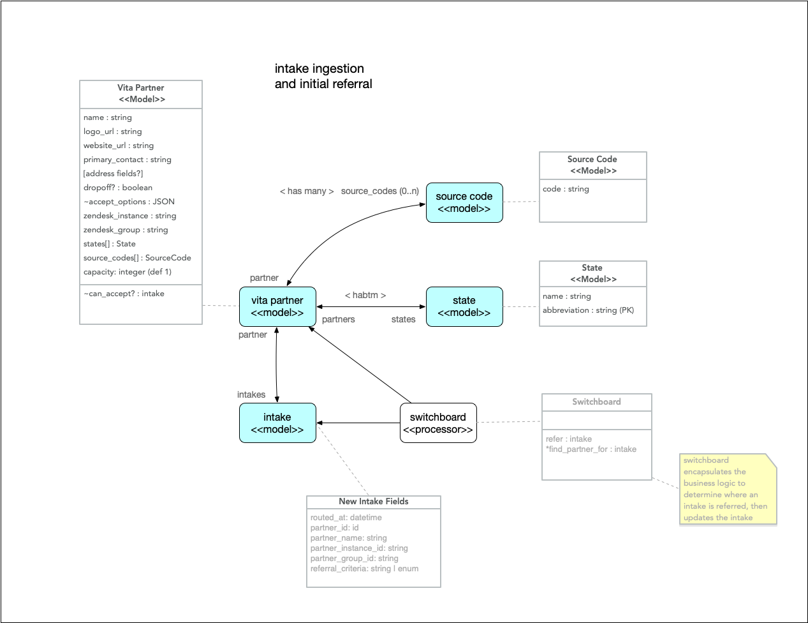
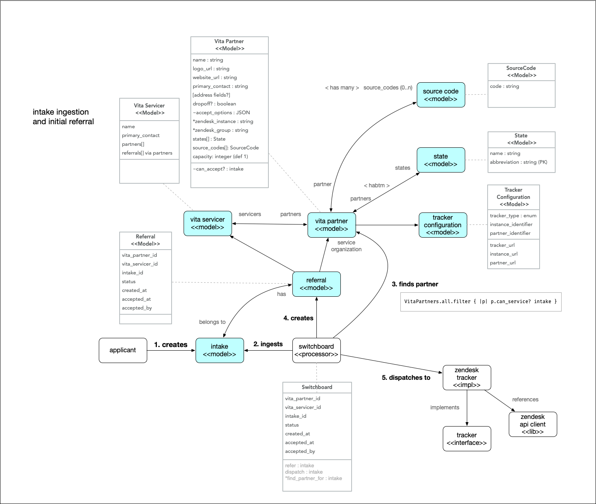

# ADR - Refactor Zendesk Routing Logic

## Status

- **Proposed**: 2020-05-07
- **Accepted/Rejected**: 2020-05-08

## Context

Routing a client intake (model: `Intake`) to a particular partner (model:
`VitaPartner`) who will service their request is perhaps the most vital
part of the GetYourRefund service. The routing follows rules as follows, in
order of priority:

1. If the intake is already routed to a partner, keep it.
2. If the intake has a source code (referral), match the beginning
   of the source code to the related partner, and route the intake to
   that related partner.
3. If the intake has a state of residence that corresponds to a state
   serviced by a partner, route the intake to that state partner.
4. Otherwise, route the intake to the overflow partner (United Way of Tucson /
   Southern Arizona, UWTSA)

Desired future functionality not currently implemented:

- allow multiple partners to provide service to the same criteria
- account for partner capacity when making assignments

At present, partner routing is accomplished in the code via a series of
constants and hard-coded values, beginning with the
[`assign_vita_partner!`](https://github.com/codeforamerica/vita-min/blob/257fa2626990b29fe23cfca0ddda0fbc3b8793af/app/models/intake.rb#L440)
function on the Intake model. This has a number of unpleasant consequences:

1. adding a partner (and their routing) means writing tests, changing code, and
   deploying.
2. as partners and routing code accumulate, it becomes more difficult to
   reason about the expected responses
3. separation of concerns is difficult to maintain: the business logic to
   determine where an intake goes is present in the Intake model and a helper module,
   while a partner model contains what should be canonical partner data:
   - `Intake` contains the methods for deciding which partner is assigned
   - `EitcZendeskInstance` contains the tables on which the decision depends
   - `VitaPartner` contains the partner name, logo, code (singular) and other
     canonical partner information
4. the relationship between the routing code and the partner data is fragile
   because it is duplicated: since the Zendesk (ZD) group id used in routing
   isn't tied to a partner, these things could easily get out of sync.

Since the original refactor request on 2020-04-14, the VitaPartner model has
been added, but routing remains the purview of constants and code. Since that
time, several tickets to add additional partners have come through,
necessitating additional testing, code adjustments, and deployments.

Given that Code For America (CfA) will be continuing to add additional partners,
and that the routing logic _has already been changed_ from a single source code
to multiple source codes, a refactor of the routing logic is in order.

The refactor should have the following properties (based on desired future need,
current pain points, and good practices):

1. routing decisions and partner assignment should be data-driven to reduce
   fragility
2. decisions, criteria, and timing should be captured to increase auditability
3. routing criteria should be flexible and easily modifiable
4. should yield code that is easier to test
5. should yield a process that is easier to reason about
6. should facilitate management of partners that is simple and quick

### Original Refactor Request

ref: [PT#172323019](https://www.pivotaltracker.com/story/show/172323019)

> **to whoever picks up this ticket, please pull in Ben G to discuss near the
> beginning**
>
> The goal of this ticket is to spend no more than a half day investigating how
> we could refactor the routing to zendesk instances and groups so that is
> clearer and easier amend in the future.
>
> **Acceptance criteria**
>
> - summarize what you decided and what you were unable to address
> - Write out tickets for the refactor tasks
>
> We recently amended this so that the intake model would return the zendesk
> instance and group. There's still a bit of weirdness with the constants,
> though, and there have been some ideas for making it better including:
>
> - making a hash that contains every state as a key and its corresponding
>   instance/group as a value
> - making a class for each partner
>
> **Needs for partner routing**
>
> - we need to be able to have visibility into how we are routing
> - we will always route by source parameter first and state second
> - we need to store information about where an intake was sent, because our
>   routing and our partner information may change after we send the intake to
>   the partner.
> - it would be helpful to know when the intake was routed

### Suggestion by @jonsgreen

ref: [story
comment](https://www.pivotaltracker.com/story/show/172323019/comments/213820510)

> Here are some of my two cents with just a little bit of brainstorming.
> Basically, my goto is to throw some models at it and let Postgres do the heavy
> lifting. Also, this seems like good preparation for an admin interface but in
> the meantime it can at least be controlled from the console/database and not
> involve code changes, merges and deploys for new partners. Something like
> this:
>
> Partner(or Organization?)
>
>     name: string group_id: string zendesk_instance: string dropoff: boolean
>     address, other details, etc...
>
>     has_many :partner_states has_many :states, through: partner_states
>     has_many :sources
>
> Source
>
>     name: string
>
>     belongs_to partner
>
> State
>
>     name: string abbrev: string
>
>     has_many :partner_states has_many :partners, through: state_partners
>
> StatePartner
>
>     has_many :partners has_many :states
>
> group_id_for_source becomes:
>
>     Source.find_by(name: source).partner.group_id
>     Partner.joins(:source).where(sources: { name: source })
>
> group_id_for_state becomes:
>
>     State.where(abbrev: state).partners.group_id
>
> I don't know enough about how these partners work and whether more complex
> modeling and associations would be appropriate. It may be that a state will
> only ever belong to one partner and so that could be simplified. Not sure if
> there is a plan for what happens when a state is managed by more than one
> partner. Perhaps something involving zipcodes needs to be considered for the
> future...

### Early Thinking by @bvandgrift

refs:

 describes closer to the refactor described here

 a generic design with an eye toward replacing Zendesk

## Decision

To review the desired outcomes:

1. routing decisions and partner assignment should be data-driven to reduce
   fragility
2. decisions, criteria, and timing should be captured to increase auditability
3. routing criteria should be flexible and easily modifiable
4. should yield code that is easier to test
5. should yield a process that is easier to reason about
6. should facilitate management of partners that is simple and quick

In order to accomplish these goals, the following steps should be implemented:

### Model Decision Criteria in Data

Performing this task will satisfy all desired outcomes except #2.

Create a State model as described above as a list of all states and territories.

    State
      * abbreviation:string (PK)
      * name:string (required)
      * has_and_belongs_to_many :vita_partners

Relate State to VitaPartner via a pivot table (`has_and_belongs_to_many`),
allowing for many partners to service a single state, and a single partner to
service many states.

Create a SourceCode model to list the source codes (referral codes) for a
partner.

    SourceCode
      * code:string (indexed, downcased)
      * vita_partner_id (FK)
      * belongs_to :vita_partner

SourceCode will belong exclusively to a single partner, and should be
implemented as belonging to (`belongs_to`) a partner, while a partner
can have many (`has_many`) related SourceCode records.

Adjust VitaPartner accordingly:

    VitaPartner
      * has_and_belongs_to_many :states
      * has_many :source_codes

Collectively, these changes will facilitate desired outcome #1. The routing
process can then use this data to drive the decision process by replacing the
decision functions as follows:

    ##
    # map the source codes to group id
    SOURCE_MATCHERS = Hash[
      SourceCode.all.map { |s| [s.code, s.vita_partner.zendesk_group_id] }
    ]

    def group_id_for_source
      # this will match the first part of the source_code
      code_match = SOURCE_MATCHERS.filter { |k, _| source.downcase.match(/^#{k}/) }
      # return the group_id of the first entry that matches
      code_match&.first&.last
    end

    def group_id_for_state
      state = State.find_by(abbreviation: state_of_residence&.upcase || state&.upcase)
      return state.vita_partners.first.zendesk_group_id if state.present? &&
                                                           !state.vita_partners.empty?
      # TODO: spread across all, not just first
      # WHEN: when we have more than one partner accepting overflow
      VitaPartner.find_by(accepts_overflow: true)
    end

Once the process has been changed away from hashes and constant values, outcomes
3, 4, and 5 will be satisfied.

Additionally, until an admin interface has been constructed, this data can
be provisioned via two .yml files: `states.yml` and `vita_partners.yml`.
Provisioning using `vita_partners.yml` is already occuring, but the file format
would need to be updated with states and source codes to build the relations
at load time.

The new proposed `vita_partners.yml` file format:

    vita_partners:
      - name: Name of Vita Partner
        zendesk_instance_domain: domain
        zendesk_group_id: "1234567890"
        display_name: Displayed Partner Name
        logo_path: "path/to/logofile.svg"
        source_parameters:
          - source_code
        states:
          - CA
          - AK
      ...

Proposed `states.yml` file format:

    states:
      - name: Alaska
        abbreviation: AK
      - name: Alabama
        abbreviation: AL
      - name: American Samoa
        abbreviation: AS
      - name: Arizona
        abbreviation: AZ

As with VitaPartners, States should be provisioned via an import.

Using .yml files will mean that updating partners and source codes will not
affect program code, satisfying desired outcome #6.

Finally, this implementation supports the desired future functionality listed
above. By adding a simple layer of round-robin distribution (or distribution
weighted by capacity) multiple partners can service the same criteria. By adding
a limit based on capacity, a route can be short-circuited to the next partner
or the overflow partner. If no additional capacity exists, the system can switch
to its over-capacity page programmatically if desired.

### Add Decision Logging for Auditability

Performing this task will satisfy the #2 desired outcome (auditability) by
adding fields to Intake to track the routing method, assigned partner, and
timing.

Add the following fields to Intake:

    Intake
      - vita_partner_id (exists)
      - vita_partner_name (exists)
      - vita_partner_group_id: string
      - routed_at:datetime
      - routing_criteria: string
      - routing_value: string

The fields `vita_partner_name` and `vita_partner_id` already exist on Intake. We
will capture the time the partner was assigned in `routed_at`. We will also
capture the critieria used to route (at present: 'source_code', 'state', or
'overflow') in `routing_criteria`. Finally, we will capture the value used in
that criteria: `state_of_residence` for 'state' and `overflow`, `intake.source`
for 'source_code'.

### Implementation

Decided 05-08-2020, proposal accepted.

Implementation will be completed and reviewed by two pair: one pair to
complete/finish the work, the other pair will review the work before committing
merging and deploying.

## Consequences

### Model Decision Criteria in Data

Generally and most critically, accepting this proposal means that the data
store (populated by the `.yml` files) will become the source of truth for VITA
partner data, as far as the routing logic is concerned.

As a follow-on decision, we should carefully consider how changes to VITA
partner data will affect existing intakes.

#### Testing

Currently, the specs include tests to ensure that specific (hard-coded)
information is routed to specific (hard-coded) group ids. Once this proposal is
implemented, those tests can be replaced with general tests using factory-built
data. _Until this replacement has occurred, the test db will need to be
populated with the same domain data--partners, states, and source codes--as the
application._ This can be accomplished by using the same data loading method in
a `before(:suite)` entry in `spec/rails_helper.rb`.

At a future time, the specs around routing should be cleaned to be
data-driven--specifically, to confirm that the data-driven methodology works as
expected--and specific values should be removed. This is a side-effect of the
data store being the source of truth, and will make the test suite much less
fragile, and much more compact.

### Add Decision Logging for Auditability

As mentioned above, if partner data changes, the saved values on Intake
(`vita_partner_name` in particular, and any others that are
cached from a partner) may over time fall out of sync with the VitaPartner they
initially referred to. For this reason, these fields should _only_ be used for
auditing, tracing, and reporting, and not for relating an Intake to any other
data in the system.
